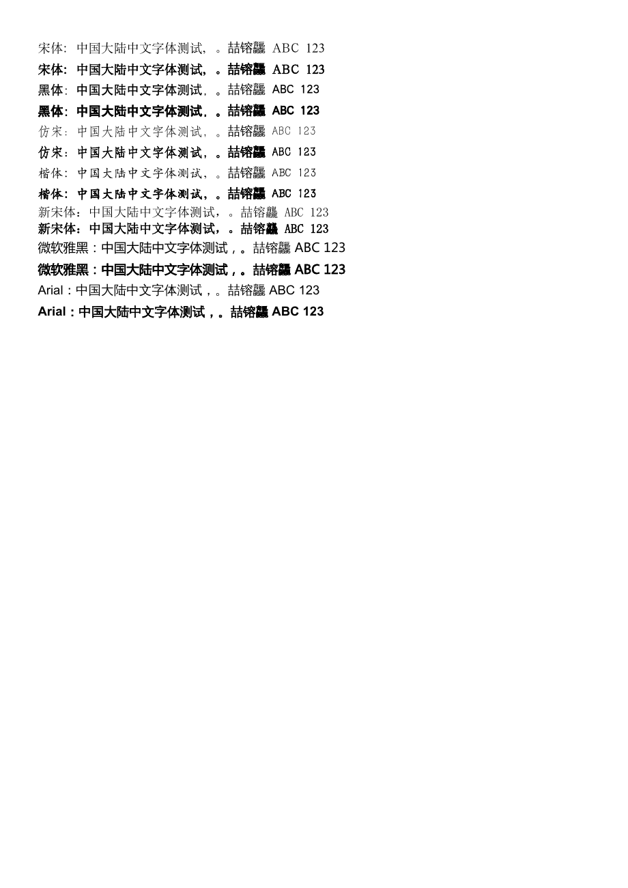

# Mainland Chinese font compatibility

The WASM editor uses the bundled font payloads, not fonts installed on the web
server. Run the repair after synchronizing upstream assets (the sync script also
runs it automatically):

```sh
node scripts/repair-chinese-fonts.mjs --asset-root .
node scripts/hash-office-assets.mjs --asset-root .
node scripts/verify-office-assets.mjs --asset-root . --en-only
node --test tests/chinese-fonts.test.mjs
```

## What the repair changes

- Maps 宋体/黑体/仿宋/楷体/新宋体/微软雅黑 to the existing SimSun/SimHei/
  FangSong/KaiTi/NSimSun/Microsoft YaHei faces, including the face-selection
  metrics. It keeps the document's requested family names and all existing
  family indices stable.
- Uses the existing WenQuanYi Zen Hei face for covered Han characters and CJK
  punctuation when a requested font lacks a glyph. It only assigns characters
  present in that face's Unicode cmap; other scripts and unsupported codepoints
  retain their previous fallback. Explicit document font choices remain intact.
- Passes all decoded SDK font streams to the WASM converter before conversion.
  The previous SDK callback ran before its asynchronous downloads completed,
  leaving the converter without fonts and producing blank PDF text. Using
  `AscFonts.getFontStream` also handles compressed embedded font streams.
- Updates the root service worker cache suffix. The index, converter helper,
  worker, font payloads, and integrity manifest must be deployed together.
  Existing editor frames should be closed and reopened after updating.

The repair is idempotent and checks the expected version-2 index and converter
structure before writing. A future upstream format change must be reviewed.
Do not hand-edit the generated index or patch minified SDK bundles.

## Findings and limits

The original localized 宋体/黑体/仿宋/楷体 payloads each had only two mapped
characters; 新宋体 had three. Their English counterparts have usable Chinese
coverage. The original fallback assigned some ordinary Han characters (including
试) to decorative fonts. These are separate defects from browser UI typography.

This first repair reuses the existing font pack and adds no font binaries. The
existing Microsoft YaHei face still covers only about 3,600 characters and most
Chinese families have no separate bold face, so missing characters use the
fallback and bold can be synthesized. No claim of Microsoft Office/WPS layout
equivalence or complete GB18030 coverage is made. A later font-pack update can
add properly sourced SC versions of Source Han Sans/Serif in regular and bold;
that requires matching metadata, coverage, license notices, and visual QA.

## Regression checks

The Node tests inspect real cmap tables, font aliases, selection metadata,
fallback coverage, font hashes, conversion handoff, and repair repeatability.
For browser QA, use a DOCX containing each Chinese family in regular and bold,
Latin text, punctuation, and rare characters such as 喆镕龘. Check:

1. Actual font requests resolve to the canonical payloads without errors.
2. Save as DOCX and reopen; text and requested family names survive.
3. Export PDF; text is visible, extractable, and fonts are embedded.
4. Compare to the old index with service workers blocked in an isolated browser
   context, otherwise a cached index can invalidate the comparison.

In the local Chromium smoke test on 2026-10-02, all 14 sample paragraphs survived
DOCX export and reopening. PDF export was blank before repairing the font
handoff; afterward the Chinese text was extractable and fonts were embedded.
This was a local static-runtime test, not a deployed application or Word/WPS
pixel-equivalence test.

Exported PDF sample (synthetic QA text):


